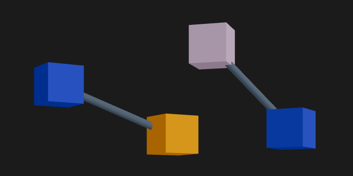

# generest

### Generative music playground using public APIs as input.

Transform publicly available data into generative music. Generest allows you to make data audible by selecting time-series data from public RESTful web APIs to drive and modulate pre-configured synthesized instruments running in your browser. Data will be discretized to harmonic scales and rhythmic time signatures to bring about a musical quality that still maps to real-life events/measurements. The input could range from sensor data like the traffic volume of a city or the water level of a river to stock prices and social media messages.

Fetches sensor data from [Newcastle Urban Observatory](https://newcastle.urbanobservatory.ac.uk/), but can be extended to other public APIs.

### Quickstart

- clone repo and navigate to root directory `generest/`
- run `npm install`
- run `npm run serve` to start proxy server
- run `npm run start` in separate terminal
- navigate to `http://localhost:5173/` in browser
- drag-and-drop shapes to the center of the screen
- right-click shape to show controls
- left-click datasource, then instrument to connect the two
- press global start button (stop, then start to synchronize instruments)

### Tech Stack

- [**Typescript**](https://www.typescriptlang.org/docs/handbook/intro.html)
- [**React three fiber**](https://r3f.docs.pmnd.rs/getting-started/introduction): a [React](https://react.dev/learn) renderer for [three.js](https://threejs.org/docs/index.html#manual/en/introduction/Creating-a-scene) - used for cubes (modules) and cylinders (connections)
  - [drei](http://drei.docs.pmnd.rs/getting-started/introduction): collection of helper tools for React three fiber
  - [React spring](https://www.react-spring.dev/docs): Fluid animations - used to change size and color of cubes
- [**Tone.js**](https://tonejs.github.io/): a Web Audio framework for creating interactive music in the browser - used for instruments
- [**Pico css**](https://picocss.com/docs): a minimal css library - dynamically loaded from cdn in index.html
- [**Express.js**](https://expressjs.com/): web framework used for a simple proxy server to fetch cross-origin data

### Main files and classes
- App.tsx: Main react component, manages state of modules & connections, creates 'menu shapes', Tone.js transport start/stop buttons

- module.ts: each datasource / instrument is an instance of the Module class and is represented by a Shape (cube)

- connection.ts: each connection between two modules is represented by a Line (cylinder)

- Shape.tsx: React component for representing modules in the scene, also creates connections

  - 3d objects using React three fiber are \<mesh\>s (or \<animated.mesh\> when using Spring)

  - \<DragControls\> is the drei component that manages drag-and-drop. absolute position of shapes is a composition od their starting position (as 'menu item' and the DragControl's position, which is the parent of Mesh)

- Line.tsx: React component representing connections through 3d cylinders.

- ControlInstrument.tsx / ControlDatasource.tsx: React component representing Module controls, visible when right-clicking on an active Shape (active are non-menu shapes)

- instrument.tsx: handles instrument creation, parameter modulation, scale and sequence generation (from numerical data) and playback

  - class Transport: Tone.js main timekeeper

  - class Instrument: manages Tone.js synth and parameters with various setters. also: transform numerical data into musical scales.

- datasource.tsx: handles API fetches and getting the fetched data into a numerical array (currently tailored to Newcastle Urban Observatory but meant to be extendable to other APIs)

### Known bugs
- It's possible to select multiple Shapes by hovering w/ unintended consequences
- Weird stuff might happen when connecting multiple datasources to one instrument
- Redundant connections can be added
- Left-clicking a datasource first and an instrument after will always make a connection, often unintended (main problem: dragging a shape also registers a left click)
- InstrumentControl input fields reset to defaults when closing and oopening again (maybe because the component gets re-rendered?)

### Missing features
- Datasource controls: especially select sensor
- Remove connections
